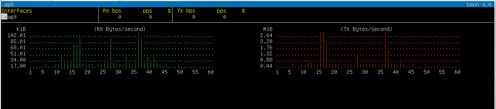

# CyberVPN: Building my own secure VPN with WireGuard

**bmon Monitoring VPN Traffic in Real-Time**

## Overview
CyberVPN is a practical WireGuard VPN setup on Ubuntu virtual machines. It demonstrates secure traffic tunneling, client-server communication, and real-time bandwidth monitoring.

## Features

- Fully functional WireGuard VPN server & client

- Secure encrypted tunnel for all client traffic

- Real-time traffic monitoring with bmon

- Step-by-step setup on Ubuntu VMs

## Prerequisites

- Ubuntu Server & Desktop ISO
- VMware Workstation Pro
- WireGuard installed on both VMs
- bmon installed on server
- NAT networking in VMware

# Quick Setup
## Server Setup

      sudo apt update && sudo apt install 

      wireguard -y

      sudo mkdir -p /etc/wireguard

      wg genkey | sudo tee /etc/wireguard/private.key | wg pubkey | sudo tee /etc/wireguard/public.key

      sudo chmod 600 /etc/wireguard/private.key

      sudo nano /etc/wireguard/wg0.conf

      sudo sysctl -p

      sudo wg-quick up wg0

      sudo systemctl enable wg-quick@wg0

      sudo ufw allow 51820/udp

      sudo wg show

## Client Setup
      sudo apt update && sudo apt install wireguard -y

      sudo mkdir -p /etc/wireguard

      wg genkey | sudo tee /etc/wireguard/private.key | wg pubkey | sudo tee /etc/wireguard/public.key

      sudo chmod 600 /etc/wireguard/private.key

      sudo nano /etc/wireguard/wg0.conf

      sudo wg-quick up wg0

      ping <SERVER_VPN_IP>

## Authorize Client on Server
      sudo wg set wg0 peer <CLIENT_PUBLIC_KEY> allowed-ips 10.8.0.2/32

## Monitor Traffic
      sudo bmon -p wg0

## Verification

Ping server VPN IP to confirm connectivity

      sudo wg show

confirms handshake and active connection

bmon displays live traffic over VPN

## Learning Outcomes

- Understanding of tunneling and VPN architecture

- Hands-on WireGuard server and client configuration

- Network security fundamentals and traffic monitoring

## Usage
### Start VPN
    sudo wg-quick up wg0

### Stop VPN
    sudo wg-quick down wg0

## Note
For detailed setup instructions, screenshots, and analysis [View Full Project Report (PDF)](docs/CyberVPN_report.pdf)
